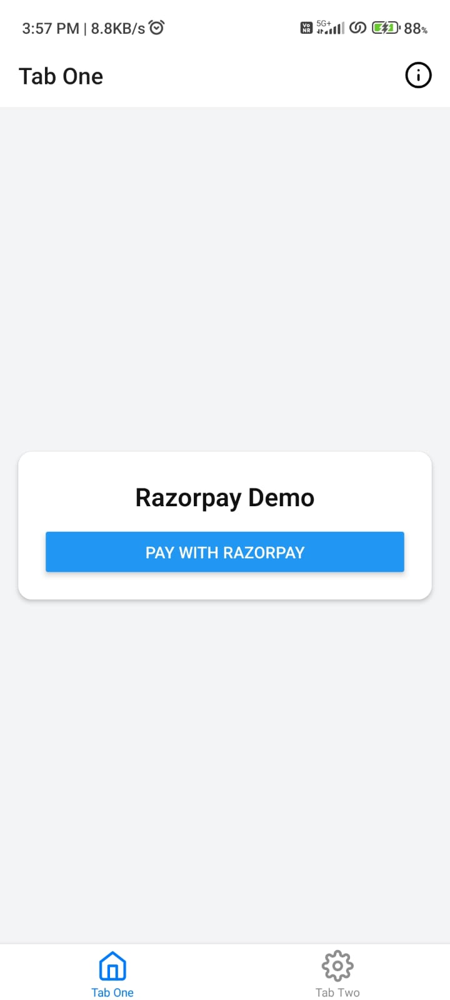
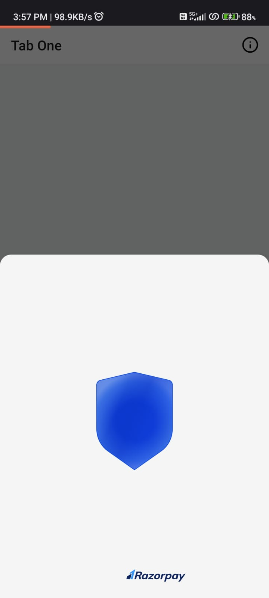

# POC for implementing Razorpay in expo 51

## Screenshots

|  |  |  |
|----|----|----|
|  |  |  |


## Steps to install

### 1. Install dependencies
```
npm i
```

> [!NOTE]
> replace the API key in /app/(tabs)/index.tsx.

### 2. Create prebuild for android/ios
```
npx expo prebuild --clean 
```

### 3. Build release apk for android
```
cd android && ./gradlew assembleRelease         
```
> [!NOTE]
> Make sure you are on Java 17.

### 4. Find the apk in
```
cd android/app/build/outputs/apk/release/

```

> [!IMPORTANT]
> This library works only on physical devices and in release/debug apk builds. It does not work in Expo Go or emulators (as far as I tested).


## Credits
- project template - [bidah/universal-nativewind-v4-starter](https://github.com/bidah/universal-nativewind-v4-starter) 